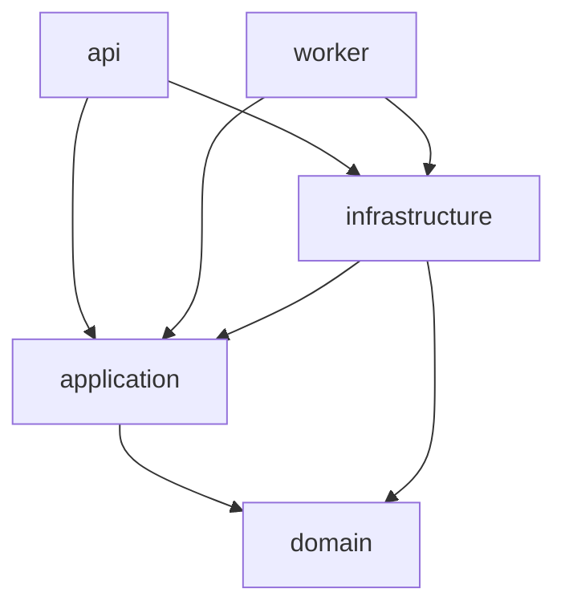
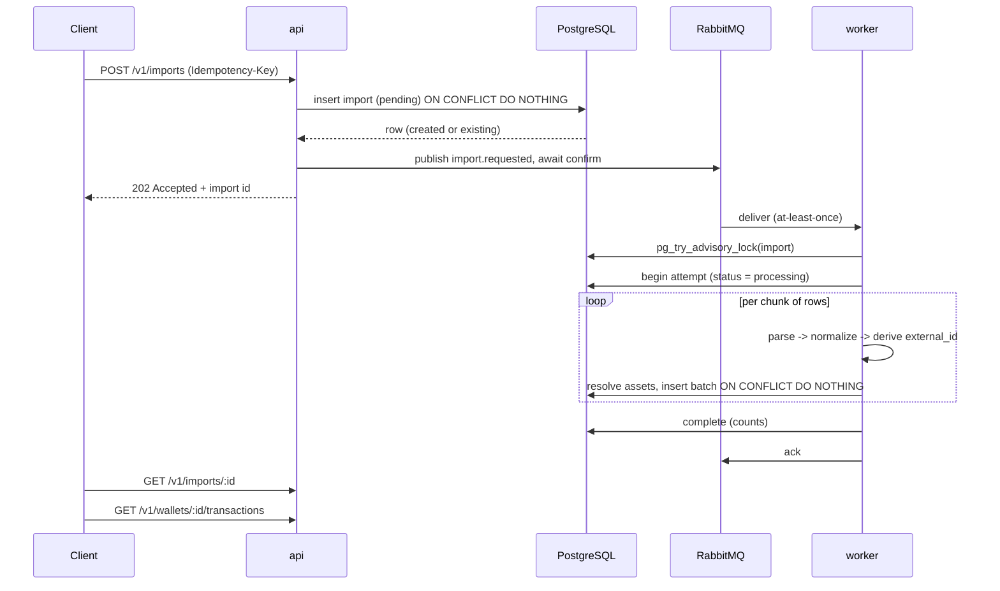

# Architecture

A skeleton for the ingestion half of a crypto-tax backend: an import is requested over HTTP,
queued, normalized by a worker, written to PostgreSQL, and read back. The interesting parts are the
seams — where a boundary is, what enforces it, and what happens when something fails halfway.

The one rule everything else follows: **dependencies point inwards, towards the domain, and the
domain points nowhere.**

Companion documents: [REQUIREMENTS.md](REQUIREMENTS.md) for what this is supposed to do, and
[docs/adr/](docs/adr/README.md) for the twelve decisions that shaped it.

## 1. Layers

Five packages, plus a sixth that exists only for the end-to-end suite.

| Package | Contains | May import |
| --- | --- | --- |
| `@app/domain` | Entities, value objects, invariants, normalization rules | nothing (one pure decimal library) |
| `@app/application` | Ports and use cases: the orchestration, with no technology in it | domain |
| `@app/infrastructure` | Adapters: PostgreSQL, RabbitMQ, filesystem, config, logging | domain, application |
| `@app/api` | HTTP entrypoint | domain, application, infrastructure (composition root only) |
| `@app/worker` | Queue entrypoint | domain, application, infrastructure (composition root only) |

`infrastructure → application` looks backwards for a moment and is the point of the whole shape: an
adapter depends on the *port* it implements, never on the use case that consumes it. A
dependency-cruiser rule forbids infrastructure from importing anything under
`application/src/use-cases`, so the arrow can never quietly reverse.

Two entrypoints, one deployable artifact and one database. This is a modular monolith, not
microservices: the boundaries are compile-time, so they can be moved cheaply when a real scaling
reason appears, and until then nobody pays for a network hop between layers (ADR-0002).

### Where does my code go?

- **A new exchange or chain** — a folder under `infrastructure/src/sources/` implementing
  `SourceAdapter`, a fixture, and a parser test. Nothing else changes; the registry is the only
  wiring.
- **A new business rule** (fee treatment, transfer matching) — `domain`, with a unit test. If it
  needs I/O to test, it is in the wrong layer.
- **A new operation** (recompute balances, re-run an import) — a use case in `application`, plus a
  port if it needs something new, then an adapter for that port.
- **A new route or message handler** — `api` or `worker`, and it must be thin enough that there is
  nothing in it worth testing.

## 2. The pipeline

The message carries an import id and a payload reference, never the payload (ADR-0010). The import
row is the source of truth; a redelivered message costs one cheap read.

## 3. Correctness under failure

Idempotency is layered, because each layer protects against a different accident (ADR-0007).

**A duplicate HTTP request.** `(user_id, idempotency_key)` is unique. The second request returns
the first import with `200` instead of `202`. The request body is fingerprinted, so reusing a key
with different content is a `409` rather than a silent mismatch.

**A duplicate message.** Delivery is at-least-once and this system treats that as the normal case.
An import that is already `completed` returns immediately without touching the payload. If it is
not, `(wallet_id, external_id)` is unique and the batch insert is `ON CONFLICT DO NOTHING`, so a
second pass over the same rows inserts nothing and reports them as skipped. This is verified
end-to-end: republishing a processed message leaves the row set byte-identical, and a *new* import
of the same file reports `imported: 0, skipped: 8`.

**A row with no natural id.** Not every source provides one. When it is missing, `external_id` is a
SHA-256 over the canonicalized content — wallet, timestamp, kind, and every leg sorted — plus an
occurrence ordinal. The ordinal is what lets two genuinely identical rows in one file stay two
events while a re-import of that file still recognizes both (ADR-0007).

**A transient failure** (database blip, broker hiccup). Errors are classified at the point they are
raised, not guessed at by the consumer: `DependencyUnavailableError` and `ConcurrencyError` are
retryable, `ValidationError` and `NotFoundError` are not. A retryable failure leaves the import in
`processing` and republishes to a TTL queue that dead-letters back onto the main exchange after the
delay. Marking it failed instead would turn a five-second outage into a lost import.

**A permanent failure** (unknown asset, malformed file). Recorded on the import row as a structured
`error`, and the message is parked in `imports.dlq`. The parking lot has no consumer on purpose: a
human decides.

**A poison message.** An envelope that fails Zod validation is dead-lettered on the first attempt.
No number of redeliveries will make it parse, and retrying it would just occupy a worker.

**A crashed worker.** The message was never acked, so RabbitMQ redelivers it to another consumer,
which finds the import in `processing` and re-runs it. Rows already written are skipped. Mutual
exclusion between the two is a PostgreSQL *session* advisory lock rather than a lease column: a
lease has to guess a timeout, and RabbitMQ redelivers within seconds of a channel dropping, so any
timeout safe for a slow-but-alive worker is far too long for a crashed one. An advisory lock is
held by a connection, and a dead connection releases it instantly.

**A partial batch.** Rows are written in chunks, one database transaction each, so a failure at row
50,000 keeps the first 49,000 — which the retry then skips. The alternative, one transaction for
the whole file, is a long-running write that blocks vacuum and throws away all the work on any
single error.

**A crash between the insert and the publish.** This window is real and is not hidden: intake
persists and then publishes, so a crash in between leaves a `pending` import with no message
(ADR-0011). The mitigations in place are a publisher confirm (a publish that did not happen is
observable, and the API returns 503 rather than a false 202) and a retry of the request with the
same key, which republishes for an existing pending row. The correct fix is a transactional outbox,
and the partial index `imports_recovery_idx` exists so the sweeper that would replace it is a query
away.

## 4. Money and identity

**Amounts are `NUMERIC(38,18)` in PostgreSQL and a `Decimal` value object in TypeScript, never
`number`** (ADR-0004). The driver is configured to return numerics as strings, because `pg` would
otherwise parse them into doubles and undo the whole exercise. `Decimal` accepts strings only,
rejects exponential notation, and rejects anything that would not survive the round trip — a value
with 19 decimal places is an error, not a silently rounded number, since PostgreSQL rounds
over-scale input without complaint. A test round-trips `0.000000000000000001` through the database
to prove it.

**A transaction is multi-leg.** A trade is an outgoing leg, an incoming leg and usually a fee, so
`transactions` owns `transaction_entries` rather than carrying one signed `amount` (ADR-0005).
Quantities are always positive; direction lives in its own column, which makes a fee impossible to
mistake for a negative amount someone forgot to subtract. Retrofitting this later means migrating
live financial data.

**Assets are rows, not strings.** `USDC` on Ethereum is not `USDC` on Solana, and tickers are
squattable. Resolution is read-only: an unknown symbol fails the import and says which symbol it
did not recognize, because a tax system that invents assets is worse than one that refuses a row.

**Identifiers are application-generated UUIDv7** (ADR-0009): time-sortable, so index locality
resembles a sequence, and available before the insert, which is what lets a batch of transactions
and their entries be built in memory and written in one statement each.

## 5. What stops this eroding

Boundaries that only exist in a document are folder names. Four mechanisms, each catching what the
others cannot:

1. **pnpm workspaces.** A package can only import what its own `package.json` declares. `domain`
   declares no workspace dependencies, so importing infrastructure there is not a lint failure — it
   is an unresolvable module.
2. **TypeScript project references.** `tsc -b` fails on an import into a project that is not
   referenced, and the reference graph is the layer diagram written in a form the compiler reads.
3. **`exports` maps.** Each package exposes one entrypoint. Nobody deep-imports
   `@app/domain/src/money/decimal.js` and quietly couples to a file path.
4. **dependency-cruiser** for the rules the first three cannot express: no cycles, no node builtins
   in the domain, adapters never importing use cases, and — the one that matters most in practice —
   only `container.ts` and `main.ts` in an entrypoint package may name a concrete adapter. A route
   that reaches past its use case into a repository fails the build.

Three more habits do the rest:

- **ESLint rules that protect invariants rather than style.** `Date.now()` and `Math.random()` are
  errors in domain and application code (take them from the `Clock` and `IdGenerator` ports);
  `process.env` is an error outside the config module and the composition roots; `parseFloat` is an
  error everywhere.
- **One contract suite, two implementations.** The same tests run against the in-memory fakes and
  the PostgreSQL adapters (ADR-0012). Without that, a fake is just a restatement of what its author
  assumed the database does, and testing use cases against it proves nothing.
- **A load check on the built artifact.** Vitest transpiles with esbuild; the image runs `tsc`
  output, and the two do not always agree. `pnpm smoke` imports every compiled entrypoint under
  plain Node. This is not hypothetical: a static field initializer that passed every test threw
  `Cannot read properties of undefined` in the container, and nothing in the test suite could have
  seen it.

CI runs typecheck, lint, dependency rules, unit tests and the smoke load on every push, and the
integration tier against real PostgreSQL and RabbitMQ.

## 6. Testing

Four tiers, each answering a question the tier below cannot:

- **Domain unit tests** — invariants and determinism. No I/O, milliseconds.
- **Use-case tests against fakes** — orchestration, including the awkward paths: a duplicate
  delivery, a worker losing the lock, a publish that fails after the row was written.
- **Repository contract tests** — the same suite against fakes and PostgreSQL, so the substitution
  above is legitimate.
- **One end-to-end test** — real HTTP handler, real broker, real worker, real database. It asserts
  the import completes, the money comes back exactly, the two identical CSV rows stay two rows, and
  that replaying the message changes nothing.

The end-to-end suite lives in `tests/e2e` rather than inside a package, because it is the only
thing in the repository that legitimately imports both entrypoints. Keeping it outside `packages/`
means "nothing depends on api or worker" stays true of shipping code.

## 7. Deliberately skipped

In the order I would add them:

1. **Transactional outbox.** Closes the persist-then-publish window described above. A `outbox`
   table written in the same transaction as the import, plus a relay. The cheap interim step is the
   stale-import sweeper the recovery index already supports.
2. **Authentication and authorization.** `x-user-id` is a stand-in for a verified subject. Tenancy
   is already in the keys and every use case takes a `userId` and checks ownership, so this is
   middleware plus, eventually, row-level security.
3. **Metrics and tracing.** Logs carry correlation ids from the HTTP request into the worker;
   `prom-client` for queue depth, import duration and DLQ rate, then OpenTelemetry spans.
4. **A raw-record table.** The payload is read on demand and rows are normalized in flight. Storing
   raw rows would allow reprocessing history after a normalization bug, which is the thing you want
   most on the day you find one.
5. **Real source clients.** `SourceAdapter` is the seam; both implementations read fixtures. A real
   one needs a rate-limited HTTP client, pagination and cursor persistence — none of which changes
   the shape.
6. **Tax logic.** No cost basis, no FX rates, no transfer matching between wallets. This is the
   ingestion half only, and pricing arrives as a `PriceProvider` port.
7. **Object storage for payloads.** `payloadRef` resolves against a fixtures directory with
   traversal checks. In production it is a bucket key; the claim-check shape does not change.
8. **Tiered backoff.** One TTL queue gives one fixed delay, because a TTL queue expires in
   publication order and a long delay would block shorter ones behind it. Exponential backoff needs
   one queue per tier.
9. **Generated database types.** Kysely's schema types are hand-written for this slice;
   `kysely-codegen` is the answer once the schema is large enough to drift.

Also skipped, and worth saying out loud: **no Redis**. Nothing here needs a cache or a distributed
lock — the advisory lock is free and already transactional with the data it protects. Per-wallet
recompute locks or exchange rate-limit budgets would change that.

## 8. Decisions

| ADR | Decision |
| --- | --- |
| [0001](docs/adr/0001-runtime-and-toolchain.md) | Node 22, pnpm and Vitest rather than Bun |
| [0002](docs/adr/0002-modular-monolith.md) | Modular monolith with two runtime roles |
| [0003](docs/adr/0003-enforced-boundaries.md) | Boundaries enforced by four independent mechanisms |
| [0004](docs/adr/0004-money-representation.md) | `NUMERIC(38,18)` and a `Decimal` value object |
| [0005](docs/adr/0005-multi-leg-transactions.md) | Multi-leg entries rather than a signed amount |
| [0006](docs/adr/0006-rabbitmq-topology.md) | RabbitMQ topology: retry queue and parking lot |
| [0007](docs/adr/0007-layered-idempotency.md) | Idempotency at intake, message and row level |
| [0008](docs/adr/0008-kysely-and-sql-migrations.md) | Kysely with hand-written SQL migrations |
| [0009](docs/adr/0009-uuidv7-identifiers.md) | Application-generated UUIDv7 identifiers |
| [0010](docs/adr/0010-claim-check-messages.md) | Claim-check messages: payload by reference |
| [0011](docs/adr/0011-persist-then-publish.md) | Persist-then-publish, outbox deferred |
| [0012](docs/adr/0012-testing-strategy.md) | Ports, fakes and a shared repository contract |
